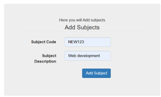
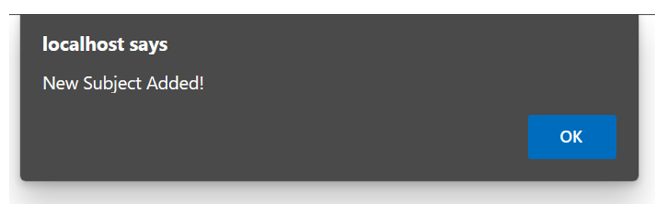
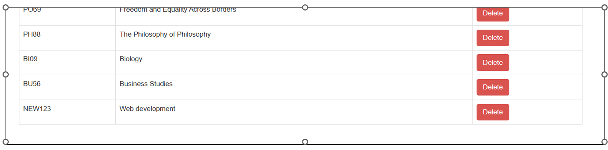
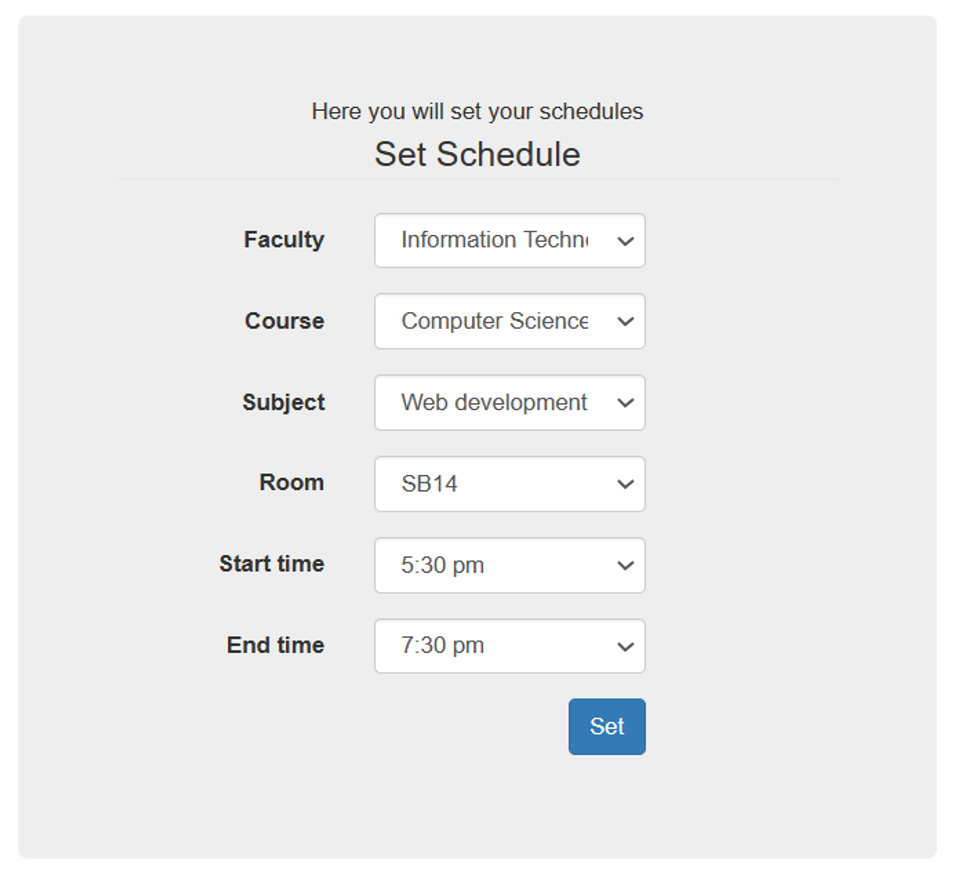
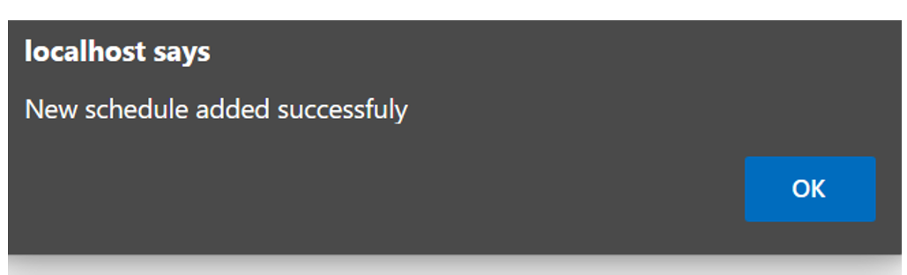
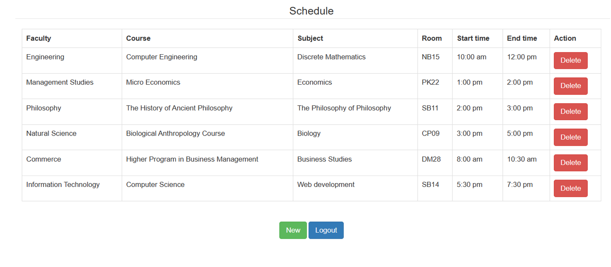

# Scheduling-system
### About:
A simple scheduling system: add course, room, teachers and create timetable  also view list of all teachers, course, rooms. 
### Online school/college Sechdule-system
**This Website is built for following purpose:-**
- View Schedule
- Login and Logout Security
- Password Changes

**The Admin have the following access to this website:-**
- Login
- Add Schedule
- Update Schedule
- Remove  or cancle Classes
- View Timetable
- Profile Edit
- Logout

**The Users have the following Access:-**
- Register
- Login
- View Schedule
- Check Schedule Availability
- Search subject/classes etc.
- View current schedule
- View Profile
- Update Profile
- Change Password
- Logout

### Technologies used:-
1. Front-End Development:
- HTML
- CSS
- Bootstrap

2. Back-End Development
- PHP

### ==== Software And Tools Required ======
-PHP
-mysql as database

NOTE: Dummy Database provided in database folder.

### The Screenshots of some of the  webPages of this project are Here:

<u>Adding new subject:</u>

<u>Viewing in list:</u>

<u>Adding schedule of new subject:</u>

<u>Viewing timetable:</u>

